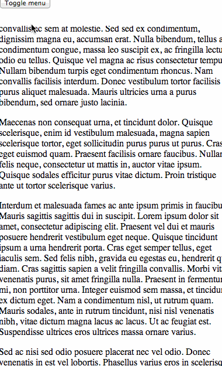

# jQuery mobile menu [](https://travis-ci.org/danielhusar/jquery-mobile-menu)

Toggle the mobile menu when you have fixed navbar.
See demo how it works. (use small page width)

### Installation
Download manually or with bower:

```ssh
$ bower install jquery-mobile-menu
```

### Sample usage

```javascript
$('button').mobileMenu();
```

## Options

#### openClass

Type: `String`  
Default: 'menu-open'

Class that is added to html when the menu is open

#### preventDefault

Type: `Boolean`  
Default: true

If the default action should be prevented. (like anchor redirect)

#### callback

Type: `Function`  
Default: noop

Function to be called each time user click the toggle button


## Demo



## License

MIT © Daniel Husar
